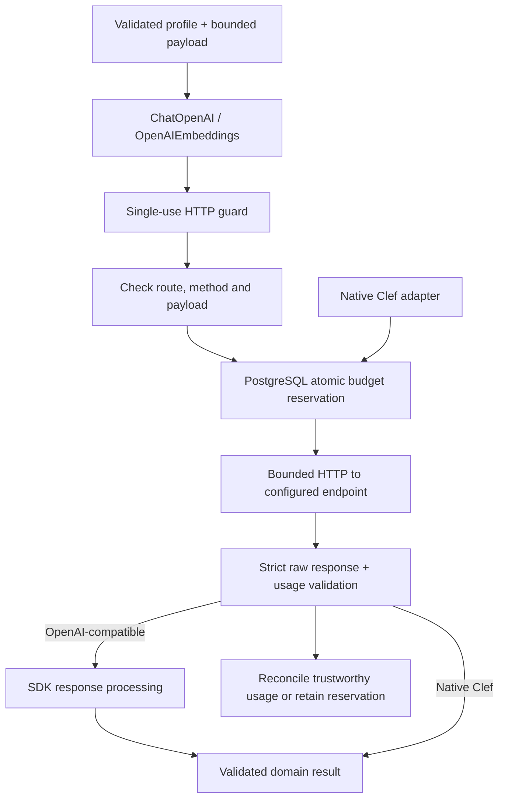
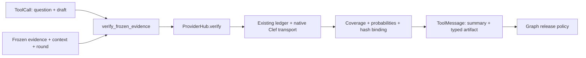

# Provider integrations

OpenAI-compatible generation and verification use `ChatOpenAI`; embeddings use
`OpenAIEmbeddings`. Native Cloudflare Clef keeps its existing adapter. No YAML
fields or endpoint/authentication contracts change.

The same adapters serve server configuration, request-scoped [dashboard BYOK](../../../../../docs/byok.md)
and [MCP retrieval](../../../../../docs/agent-rag-interface.md). Browser keys are
not persisted in jobs or results. MCP search only uses the configured query
embedding role; it never invokes generation or verification. A live application
can retain deterministic fixture embeddings through `runtime.embedding_mode`;
those results remain labeled `fixture_only`.

## Request and spending flow



`providers/sdk.py` supplies a scoped asynchronous HTTP client to each SDK call.
The SDK receives an inert URL and placeholder key; only the guarded callback
knows the configured URL and credentials. An unexpected route, changed payload
or second request is rejected before reservation or network access. A narrow
compatibility shim preserves configured `max_tokens` and system-message contracts
when ChatOpenAI normalizes them.

The callback reserves against the actual outgoing payload before sending it.
PostgreSQL enforces shared phase/total limits under concurrent workers. SDK retries
are disabled (`max_retries=0`); each executor retry requires a fresh reservation.
Unknown or invalid usage retains the conservative reservation. These application
limits are admission controls based on configured rates, not a provider invoice.

Embedding batches remain application-owned. `check_embedding_ctx_length=False`,
`tiktoken_enabled=False` and a chunk size equal to the admitted batch avoid hidden
splitting and tokenizer downloads. Chat uses the chat-completions endpoint with
streaming, caching and Responses API routing disabled.

Raw JSON, usage and domain results are validated before SDK normalization. The
normalized SDK return is not the authority for acceptance or charges: it can
coerce values that the application must reject. Duplicate/malformed JSON,
refusals, incomplete responses, tool responses and invalid embedding vectors
still fail the existing strict checks. Response sizes, deadlines, cancellation
and safe errors remain enforced in `transport.py`.

Ambient content tracing is disabled around SDK calls. Explicit LangSmith export
contains stage metadata only. Clef does not enter the SDK guard; its native
choice/probability decoding and evidence-binding checks remain unchanged.

## Built-in reuse

| Responsibility | Implementation |
|---|---|
| OpenAI protocol integration | `ChatOpenAI`, `OpenAIEmbeddings` through `sdk.py` |
| Prompts and chat messages | `ChatPromptTemplate`, `convert_to_openai_messages` in `prompts.py` |
| Strict schemas | Domain-derived Pydantic models and `convert_to_openai_function(strict=True)` in `openai.py` |
| Structured output | LCEL composition and `PydanticOutputParser`, after strict wire validation |
| Model and embedding interfaces | `BaseChatModel`, `Embeddings` bound to trusted evidence and call context |
| Retrieval/source/verification tools | Scoped `StructuredTool` in `integrations/tools.py`; verification reuses `ProviderHub.verify` |
| Query orchestration | LangGraph `StateGraph` in `graph.py` |

LangChain's tolerant JSON parser operates only on a canonical validated draft.
Verification additionally requires complete check coverage and immutable evidence
hashes. Deterministic fixtures remain in `mock.py`; role selection and bounded
repair remain in `ProviderHub`.

## Verification

Run `task check` and `task build` from the repository root. SDK tests invoke the
real integration classes with mocked HTTP, including mutation/extra-request
rejection, retries, raw usage validation and unchanged native Clef routing.
Concurrent reservation coverage requires dedicated native PostgreSQL test DSNs.
No real model calls are required. See the root [test commands](../../../../../README.md#tests-recovery-and-operations).

Dependency behavior was checked against current LangChain documentation and the
installed `langchain-openai==1.6.7` / `openai==3.24.0` sources. See the official
[chat integration](https://docs.langchain.com/oss/python/integrations/chat/openai)
and [embedding integration](https://docs.langchain.com/oss/python/integrations/text_embedding/openai).


## Clef in the LangChain toolset

`verification_tool` wraps the existing adapter rather than translating Clef into
chat completions. The same factory supports configured chat or mock verification.
No additional dependency, credential or configuration is needed; activate Clef
with the existing [sample configuration](../../../../../configs/clef.example.yaml).



```python
from evidence_lab.integrations.tools import verification_tool

# Bind trusted scope per verification round; reuse the current hub and context.
verifier = verification_tool(hub, evidence, context, round_id="initial")
message = await verifier.ainvoke({
    "type": "tool_call", "id": "verify-initial", "name": verifier.name,
    "args": {"question": question, "draft": draft.model_dump(mode="json")},
})
verification = message.artifact  # Full VerificationResult for application policy.
```

Standard `content_and_artifact` separates model-facing summary checks from raw
provider data retained in the typed artifact. Calling with a plain argument dict
returns the summary only; use ToolCall form when full policy data is required.
The tool has no evidence/profile/budget overrides and adds no retries. It does not
release answers or expose unrestricted native Clef question schemas. Bind a new
tool for each frozen pack/round; Clef probabilities are not calibrated confidence.
The graph explicitly invokes this tool; generation does not select arbitrary tools.
