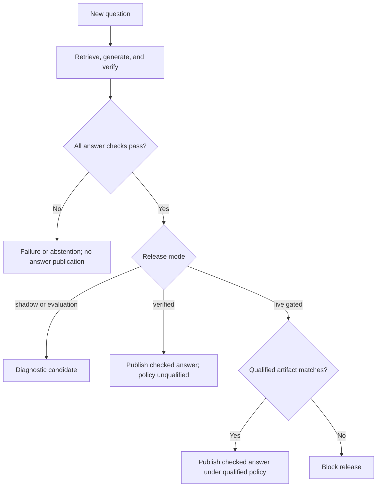

# Qualification and answer-release assurance

Evidence Lab uses two separate decisions: whether one answer passes its checks,
and whether a measured configuration has enough evidence to qualify its release
policy. Passing an answer check does not qualify the policy. A qualified policy
does not excuse an answer from its checks.

This guide describes the current implementation. The authoritative mechanisms are
[answer checking and policy matching](../apps/evidence-lab/src/evidence_lab/policy.py),
[query execution](../apps/evidence-lab/src/evidence_lab/engine.py), and
[evaluation and qualification](../apps/evidence-lab/src/evidence_lab/evaluation.py).
See [the configuration reference](../README.md#configuration-reference) for fields
and [the evaluation protocol](evaluation.md) for dataset and artifact details.

## 1. What each assurance mechanism establishes

| Mechanism | What it establishes | What it does not establish |
| --- | --- | --- |
| Per-answer verification | The exact candidate passed structural and verifier checks against its retrieved evidence. | Human-reviewed correctness, completeness, or policy quality across other questions. |
| Human-reviewed evaluation | Observed performance on the declared frozen dataset, including failures and incomplete reviews. | Performance on every future document or domain. |
| Operational studies | Recorded fault handling, live concurrent latency, and verifier repeatability for the measured implementation. | Production readiness or guaranteed future availability. |
| Qualification import | Supplied evaluation and operational evidence satisfy the implemented qualification criteria and bindings. | Independent authentication of reviewers or remote execution. |
| Runtime artifact matching | The selected artifact declares qualification and matches the running configuration and implementation. | A new evaluation, signature verification, or recomputation of the original study. |

Support means support from the supplied sources. These mechanisms do not establish
that those sources are factually correct, current, or sufficient for a real-world decision.

## 2. Per-answer checks run before publication

A query retrieves a corpus-scoped evidence snapshot, generates a structured draft,
and verifies that exact draft. The publication path requires:

- A valid answer schema and permitted block count/size.
- Known citation IDs; explicitly quoted text must occur verbatim in a cited chunk.
- Valid evidence hashes and source coordinates.
- One support verdict for every answer block.
- Passing `global.task_scope`, `global.internal_consistency`, and
  `global.counterevidence` checks.
- Complete, unique check coverage with the correct check kinds.
- Matching answer hash, evidence hash, and verification round ID.
- Successful verifier execution and, when configured, a score meeting
  `verification.score_threshold` for every check.

A complete semantic rejection may trigger at most one content repair. The repaired
candidate uses the same frozen evidence and must pass a new complete verification
batch. Schema/provider errors, missing checks, or mismatched hashes are technical
failures; they cannot authorize a content repair or answer publication.

Deadlines, attempt allowances, spending limits, and worker leases also constrain
execution. Publication uses the owning worker's fenced database write. A lost
lease cannot publish an answer. Empty evidence produces an abstention without
inventing an answer.

## 3. Release modes choose the additional publication condition

| `verification.mode` | Behavior after answer checks |
| --- | --- |
| `shadow` | Keep the checked candidate in operator diagnostics. No automatic public answer. |
| `evaluation` | Keep interactive candidates diagnostic-only. This setting does not start an evaluation study. |
| `verified` | Automatically publish passing answers without requiring policy qualification. Live runs record `qualification: verified`; policy status remains `qualified: false`. |
| `gated` | In live mode, require a matching qualified policy before inference and publication. Every answer still has to pass its checks. |

Mock execution always retains `fixture_only` provenance. In mock `verified` or
`gated` mode, deterministic passing answers may publish; this is a plumbing test,
not evidence of live model quality.

The server was configured to use `verified` on 6 October 2026. This is an
operational snapshot, not a permanent default; inspect `/api/status` to confirm the
current policy state. Changing release mode does not republish historical failed
or shadow runs.



For live `gated` execution, the artifact condition is also checked before inference;
the diagram shows its role at publication.

## 4. Build qualification evidence before enabling a gated policy

### Select and freeze the candidate

Use development data to choose the verifier profile and acceptance behavior. The
documented development protocol has 100 questions from ten source families, plus
100 supported claims and 100 matched unsupported mutations. Held-out families
must remain separate from development families.

Before the held-out run, freeze the dataset, source versions, model contracts,
prompts, retrieval settings, threshold, and repair policy. Record the dataset
version/hash, `frozen_at`, and the preselected verifier profile. Every question for
a corpus must observe the same embedding space and corpus revision during the study.

Native Clef qualification additionally requires a non-null native-score threshold
that matches the development-selected threshold, and a recorded selection date no
later than the dataset freeze. Chat-completions qualification uses categorical
labels with no invented probability threshold. Native scores are not presented as
calibrated probabilities of factual correctness.

### Run held-out questions and controlled challenges

The implemented held-out requirements are:

| Evidence component | Required composition |
| --- | --- |
| Questions | Exactly 200 from twenty held-out source families: 140 answerable, 40 missing-evidence, and 20 conflict cases. |
| Multiple-evidence questions | At least forty answerable cases with at least two required facts and distinct gold evidence spans. |
| Controlled claims | 200 supported originals and 200 one-to-one matched unsupported mutations. |
| Mutation categories | Twenty-five each: negation, number/unit, entity, date, condition, scope/quantifier, unsupported addition, and misleading combination. |

Controlled claims are verified verbatim, without generation or content repair.
An incorrect challenge cannot be counted as successful because a repair removed it.

The paired question study compares A (diagnostic ungated candidate), B (structural
checks), C (structural plus semantic checks), and D (C plus at most one fully
rechecked repair). D is the primary qualification variant.

The bundled synthetic demo is mock-only and cannot qualify a live policy. The
ordinary evaluation report intentionally remains unqualified until the separate
qualification command imports all required operational studies.

### Complete independent human review

Two domain-appropriate reviewers label independently and adjudicate disagreements.
Record distinct reviewer IDs, adjudicator ID, date, and review notes. Review the
question/evidence gold and controlled labels, then every distinct initial,
repaired, and final answer, blind to its verdict and variant.

Output annotations bind to the dataset and exact answer hashes. Unknown labels
remain pending; they are not counted as correct. The application checks the review
record's structure, but reviewer identities and independence remain operator assertions.

### Meet the implemented quality targets

| Criterion | Required result |
| --- | --- |
| Required evidence in packed top eight | At least 126/140 answerable cases. |
| Controlled false acceptance | At most 10/200 unsupported claims accepted. |
| Controlled supported retention | At least 180/200 supported originals accepted. |
| D correct and complete | At least 105/140, and no more than seven fewer correct-complete answers than A. |
| Appropriate missing-evidence response | At least 38/40. |
| Appropriate conflict response | At least 19/20. |
| Final-response audit | All 200 D final responses reviewed, at least 100 reviewed substantive releases, and zero observed materially unsupported final responses. |
| Live completion | At least 198/200 finish with an answer or valid abstention. |

Cancelled, interrupted, budget-exhausted, and technically failed cases cannot
silently disappear from the denominators. Zero observed errors in a finite study
does not mean zero future risk.

### Supply the three operational artifacts

All artifacts must bind to the evaluation ID, dataset hash, semantic policy
fingerprint, and implementation fingerprint, and show complete execution.

| Artifact | Assurance evidence |
| --- | --- |
| Fault suite | All sixteen named fault areas pass with named test IDs and no failures, errors, or skips. Includes actual native PostgreSQL and restore verification, plus migration/PostgreSQL/pgvector versions. |
| Live load | Real API/worker execution at four concurrent requests, unique durable run IDs, queue-inclusive timings, cold/warm and repair/no-repair cohorts. p95 is at most twenty seconds without repair and forty with repair, under the study's sixty-second/ten-attempt limits. |
| Verifier repeatability | Twenty predeclared held-out question IDs, three attempts each, using the exact frozen initial draft and evidence. Report disagreement and failures; do not select a threshold retrospectively. |

Passing `task check` is engineering evidence. It does not itself create the fault
artifact or measure model accuracy, live latency, or repeatability. The repository
has no dedicated fault-artifact runner; that evidence must be collected and
recorded externally. See [experiments.md](experiments.md) for the live study workflow.

## 5. Issue a policy artifact and enable it

The following command is illustrative: the paths must contain actual reviewed
results and completed studies. It assesses existing evidence; it does not make
provider calls or supply missing human labels.

```bash
task app:cli -- --config configs/private.yaml qualify \
  artifacts/reviewed-evaluation/report.json \
  --fault-artifact artifacts/externally-collected-fault-study.json \
  --load-artifact artifacts/load/combined-load.json \
  --repeatability-artifact artifacts/repeatability/report.json \
  --policy-id reviewed-candidate-v1 \
  --output policies/reviewed-candidate-v1.json
```

`qualify` recomputes evaluation metrics from the supplied report and annotations,
checks the current candidate identity and imported artifacts, and records every
unmet requirement. It writes `qualified: true` only when all qualification checks
pass. The CLI refuses to overwrite an existing output policy file and exits with
failure for an unqualified result.

A policy records its ID, semantic and implementation fingerprints, evaluation ID,
dataset hash, review/completion flags, qualification checks, unmet requirements,
and hashes of imported artifacts and adjudications. Keep the original reports and
provenance alongside it; the policy is their release decision, not their replacement.

Only after a passing result should an operator configure:

```yaml
verification:
  mode: gated
  policy_id: reviewed-candidate-v1
  policy_path: /app/policies/reviewed-candidate-v1.json
```

The path must exist and be readable in the application's environment. Relative
policy paths resolve from its working directory. Reload the API and worker after
changing private configuration, then inspect `/api/status` for
`release_allowed: true` and `qualified: true`.

## 6. What runtime matching actually checks

The runtime reads the selected policy file with a two-million-byte size cap. It
requires a JSON object declaring:

- The configured policy ID and matching semantic fingerprint.
- `qualified: true`, `runtime_mode: live`, and `human_reviewed: true`.
- A nonempty evaluation ID, `primary_variant: D`, and `complete: true`.
- The current implementation fingerprint.

Missing, malformed, oversized, incomplete, or mismatched artifacts leave the live
gate unqualified. Publication mode is excluded from the semantic fingerprint so
studies can run in shadow mode before the candidate is enabled as gated.

The semantic fingerprint includes selected provider contracts and model revisions,
retrieval/chunking behavior, embedding execution mode, query limits, score threshold,
repair policy, global checks, and prompt/schema versions. The implementation
fingerprint hashes application files and the dashboard build available in the
runtime working directory. Qualify against the deployed build: relevant code or
built-asset differences can invalidate a development-generated artifact. Credential
values are excluded from the semantic fingerprint; key rotation alone does not
change it.

Runtime matching does **not** recompute the evaluation's metrics, re-import all
operational artifacts, verify a digital signature, or authenticate reviewers.
Policy files and their underlying records are trusted operator-controlled inputs.
Protect their write access and retain actual provenance. Manually setting
`qualified: true` is not a substitute for qualification evidence, even if a
fabricated file can satisfy the runtime's metadata checks.

Corpus snapshots are checked for consistency within the study. The live policy
matcher does not automatically bind every later corpus revision to the evaluated
snapshot. New or changed documents still receive per-answer checks, but require
fresh representative evidence before claiming the measured policy generalizes to them.

## 7. How operator overrides differ

An authenticated operator can release one checked shadow run blocked only by
`policy_not_qualified`. The server revalidates its stored draft, verification
bindings, current threshold, and active sources. It records the approval reason
and publishes `qualification: operator_approved` without qualifying the policy.

Revocation hides the public answer, retains its diagnostic history, removes copied
conversation context, and cancels/fences pending dependent queries. Neither action
makes a model call. See [the operator approval contract](contracts.md#operator-approval).

An override cannot rescue an invalid generator response, incomplete verification,
or a semantically rejected answer. Automatic `verified` mode removes the need to
approve each passing new query; it still does not create a qualified policy.

## 8. Diagnose a blocked release

| Observation | Meaning and next action |
| --- | --- |
| `shadow` with `policy_not_qualified` | Answer checks passed, but the configured publication mode did not release it. Inspect its trace, use a per-run approval, or deliberately select `verified` mode. |
| `policy_not_ready` in live gated mode | No matching qualified policy was available before inference. Inspect the configured ID/path and fingerprints; supply genuine matching qualification evidence. |
| `invalid_response` during generation | No valid candidate reached verification. Correct provider output/schema behavior; changing release mode does not fix it. |
| Verification unavailable, incomplete coverage, or hash/round mismatch | A technical verification failure. Correct the failing boundary; do not publish the unchecked candidate. |
| Semantic rejection after repair | The required support/global/threshold checks still failed. Improve the evidence or question; qualification does not override those checks. |
| `qualification: verified` | Automatic per-answer checks passed; the policy is not claiming qualification. |
| `qualification: qualified` | The live matching policy permitted publication after the answer's own checks passed. |

Maintainers should update this guide when qualification criteria, fingerprints,
publication modes, operator approval, or artifact validation change. Detailed
metric/artifact definitions remain in [evaluation.md](evaluation.md); configuration
values remain in [README.md](../README.md#configuration-reference).
